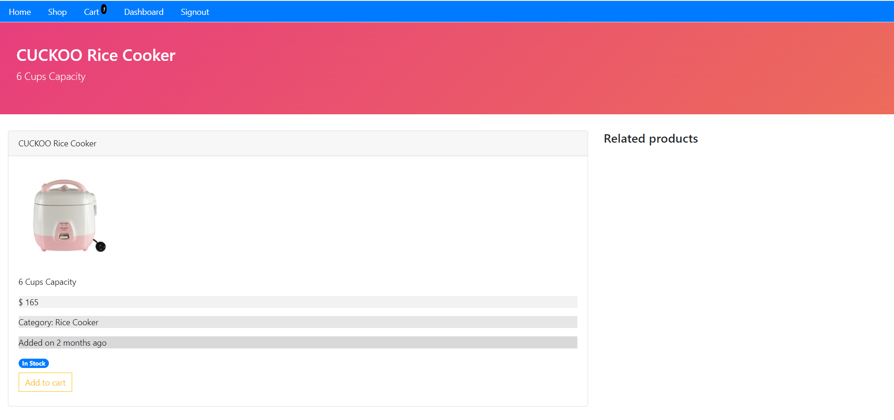

# ecommerce-online-store-backend
Back end of the ecommerce store, made using NodeJS and MongoDB as a database

To clone and run this project, you'll need Git, Node.js (which comes with npm) installed on your computer and MongoDB Compass. 

From your command line:

# Clone this repository
$ git clone https://github.com/peterannguyenn/ecommerce-online-store-backend.git

# Go into the repository
$ cd ecommerce-online-store-backend

# Install dependencies
$ npm install

# Create Local MongoDB Collection
$ Create Products, Users, Orders, Categories Collections and import Database files

# Start
$ npm start

# Images

